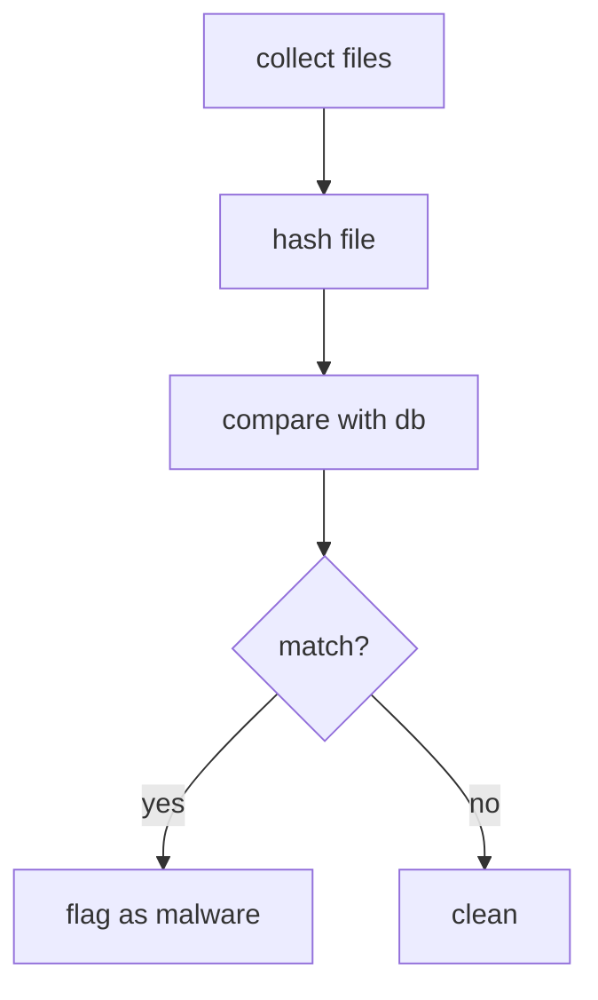

# Hash Bit Detection (v 0.1.0)

## Flowchart

## About the Flowchart

Holy Shit it looks simple at the flowchart. Its even looks simpler if i put it to word. I often explain the hash bit detection this way

"First you collect all the file in the system, then you hash it, then you compare it with the Hashed malware file you store in the database"

Well, no wonder it looks like a trivial project. Actually, it is a trivial project. The fact it takes me a relatively long time to complete this indicate show much big of procrastinator i am. 

Enough from me, it's time for the brief and clear explanation for everything i've done.

## May We be blessed

### Collect Files 
[[Collect Files]]

### Hash File
[[Hash File]]

### Comparison
[[Compare with DB]]

### Result
[[Result]]

